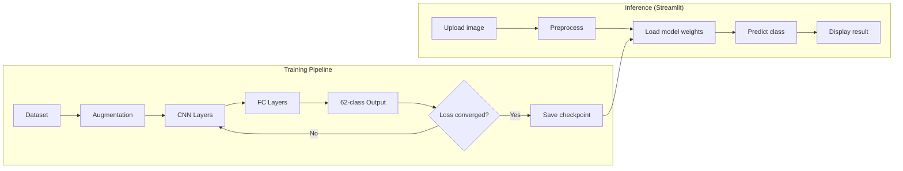

# OCR-with-torch

A convolutional neural network for handwritten character recognition — covering 62 classes (A–Z, a–z, 0–9) with 95% accuracy.

## Stack

- Python 3
- PyTorch — model architecture and training
- Streamlit — interactive web demo
- OpenCV — image preprocessing
- Matplotlib — visualization

## How it works

A deep CNN is trained on the A-Z + a-z + 0-9 handwritten character dataset.



The model architecture uses convolutional layers for feature extraction followed by fully connected layers for classification. Training includes data augmentation, learning rate scheduling, and checkpoint-based early stopping. The best-performing weights are saved and loaded for inference.

A Streamlit app provides a web interface: upload or draw a character and the model predicts it in real-time.

## Key features

- 62-class character recognition (mixed case + digits)
- 95% test accuracy
- Streamlit web interface for interactive testing
- Training pipeline with augmentation and checkpointing
- Pre-trained weights included

## What this demonstrates

- Deep CNN architecture design and training
- PyTorch data pipeline (loaders, transforms, augmentation)
- Model evaluation and checkpoint management
- Building a web demo with Streamlit
- Image preprocessing for OCR

## Run locally

```bash
pip install torch torchvision streamlit opencv-python pillow matplotlib
streamlit run streamlit_app.py
```

For training from scratch:

```bash
python ocr.py
```
